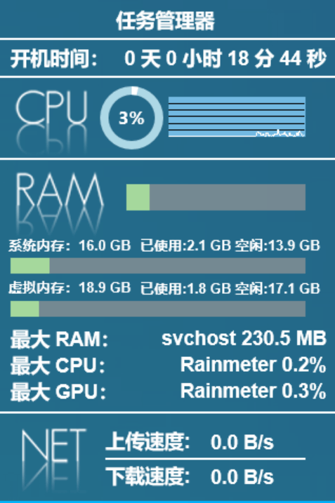

Language: EN [CN][ReadmeCN]

[ReadmeCN]: ./README_CN.md

# Rainmeter Skins
[![Rainmeter Version][]](https://www.rainmeter.net/) [![Platform][]]() [![Downloads][]](https://github.com/Mister-Kin/RainmeterSkins/releases/latest) [![License][]](https://creativecommons.org/licenses/by-nc-sa/3.0/cn/)

[Rainmeter Version]: https://img.shields.io/badge/rainmeter-v4.5.17+-blue
[Platform]: https://img.shields.io/badge/platform-Windows%2010%20(1709%20or%20later)-blue
[Downloads]: https://img.shields.io/github/downloads/Mister-Kin/RainmeterSkins/total?color=blue
[License]: https://img.shields.io/badge/license-CC%20BY--NC--SA%203.0-blue

## Introduction
My personal modified and customized rainmeter skins based on some skins. [Rainmeter][] is a free, open source application for Windows PC that supports running rainmeter skins on the desktop.

[Rainmeter]: https://www.rainmeter.net/

## Skins List
- **Reflection Clock**: Display basic clock, year, month and day information
- **Text Launcher**: The ultimate easy launcher, no graphic elements, only the program application name is displayed, click on the name to launch the program
- **System Information**: Display basic system information, such as uptime, CPU usage, memory usage, internet speed monitoring, etc.
- **Rainmeter Preset System Information**: Default skin included in the rainmeter software, displaying basic system information, adding support for monitoring network speed after modification and customization

 

 

## Download
[Jump to Download Page][]

[Jump to Download Page]: https://github.com/Mister-Kin/RainmeterSkins/releases

## Usage
[Jump to Documentation Page][]

[Offline Documentation - PDF][] (Access Code: docs)

[Jump to Documentation Page]: https://mister-kin.github.io/works/software-works/rainmeter-skins/
[Offline Documentation - PDF]: https://wwr.lanzoui.com/b02c7lamf

## Author
**RainmeterSkins** © Mr. Kin, all files released under the [CC BY-NC-SA 3.0][] license.

Authored and maintained by Mr. Kin.

> [Blog][] · [GitHub][] · [Weibo][] · [Zhihu][] · [AcFun][] · [Bilibili][] · [Youku][] · [Headline][] · [YouTube][]

[CC BY-NC-SA 3.0]: https://creativecommons.org/licenses/by-nc-sa/3.0/cn/
[Blog]: https://mister-kin.github.io
[GitHub]: https://github.com/mister-kin
[Weibo]: https://weibo.com/6270111192
[Bilibili]: http://space.bilibili.com/17025250?
[Youku]: http://i.youku.com/i/UNjA3MTk5Mjgw?spm=a2hzp.8253869.0.0
[YouTube]: https://www.youtube.com/@Mister-Kin
[Headline]: https://www.toutiao.com/c/user/835254071079053/#mid=1663279303982091
[Zhihu]: https://www.zhihu.com/people/drwu-94
[AcFun]: https://www.acfun.cn/u/73269306
