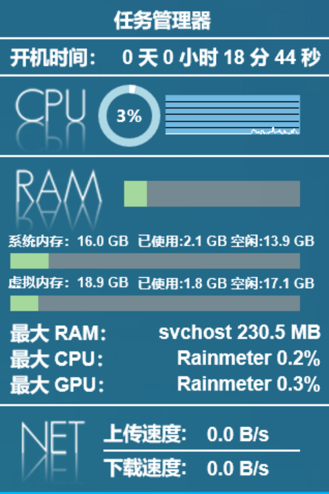
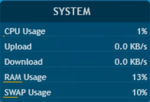

语言: [英][Readme] 中

[Readme]: ./README.md

# 雨滴皮肤
[![Rainmeter Version][]](https://www.rainmeter.net/) [![Platform][]]() [![Downloads][]](https://github.com/Mister-Kin/RainmeterSkins/releases/latest) [![License][]](https://creativecommons.org/licenses/by-nc-sa/3.0/cn/)

[Rainmeter Version]: https://img.shields.io/badge/rainmeter-v4.5.17+-blue
[Platform]: https://img.shields.io/badge/platform-Windows%2010%20(1709%20or%20later)-blue
[Downloads]: https://img.shields.io/github/downloads/Mister-Kin/RainmeterSkins/total?color=blue
[License]: https://img.shields.io/badge/license-CC%20BY--NC--SA%203.0-blue

## 简介
基于一些皮肤，我的个人修改订制的雨滴皮肤。[雨滴][]是一款免费的、开源的、面向Windows个人电脑的应用程序，支持在桌面上运行雨滴皮肤。

[雨滴]: https://www.rainmeter.net/

## 皮肤列表
- **倒影时钟**：显示基本时钟、年月日等信息
- **文字启动器**：极致简便的启动器，没有图形元素，只显示程序应用名称，点击名称即可启动程序
- **系统信息**：显示基本系统信息，如开机时间、CPU内存占用、网速监测等
- **雨滴预设系统信息**：雨滴软件自带的预设皮肤，显示基本的系统信息，修改及订制后增加支持监测网速

 

 

## 下载
[跳转到下载页面][]

[跳转到下载页面]: https://github.com/Mister-Kin/RainmeterSkins/releases/latest

## 使用方法
[跳转到文档页面][]

[离线文档 - PDF][]（访问密码：docs）

[跳转到文档页面]: https://mister-kin.github.io/works/software-works/rainmeter-skins/
[离线文档 - PDF]: https://wwr.lanzoui.com/b02c7lamf#docs

## 作者
**雨滴皮肤** © Mr. Kin，所有文件均采用 [CC BY-NC-SA 3.0][] 许可协议进行发布。

由 Mr. Kin 著作并维护。

> [博客][] · [GitHub][] · [微博][] · [知乎][] · [AcFun][] · [哔哩哔哩][] · [优酷][] · [头条][] · [油管][]

[CC BY-NC-SA 3.0]: https://creativecommons.org/licenses/by-nc-sa/3.0/cn/
[博客]: https://mister-kin.github.io
[GitHub]: https://github.com/mister-kin
[微博]: https://weibo.com/6270111192
[知乎]: https://www.zhihu.com/people/drwu-94
[哔哩哔哩]: http://space.bilibili.com/17025250?
[优酷]: http://i.youku.com/i/UNjA3MTk5Mjgw?spm=a2hzp.8253869.0.0
[头条]: https://www.toutiao.com/c/user/835254071079053/#mid=1663279303982091
[油管]: https://www.youtube.com/@Mister-Kin
[AcFun]: https://www.acfun.cn/u/73269306
